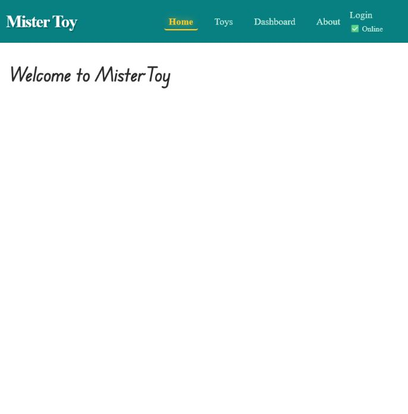
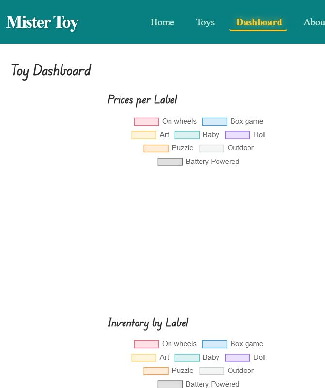

# MisterToy Backend

## Badges

[](LICENSE)
[](#project-status)
[](#development)
[](https://mistertoy-app.onrender.com/)

## Project Status

- State: Experimental / Not Ready
- Repository type: Coding Academy backend/API project
- Release policy: Pre-release `0.x` Semantic Versioning until the final GRS audit passes
- Current package version: `0.1.0`

This repository is usable for development work, but it is not yet considered release-ready.

## Overview

MisterToy Backend is the Node.js and Express API repository for the MisterToy Coding Academy project. It provides authentication, toy management, user management, and static serving of the frontend build output.

The frontend source code lives in a separate project. This backend repository serves the built frontend assets copied into `public/` during the frontend build workflow.

To run the full product locally, keep both repositories checked out side by side. Frontend source changes belong in the frontend repository, and its build-sync workflow updates this backend repository's tracked `public/` output.

Related frontend repository:

- [aviad-benhamo/ca-mistertoy-frontend](https://github.com/aviad-benhamo/ca-mistertoy-frontend)

Related repository documents:

- [SECURITY.md](SECURITY.md)
- [CHANGELOG.md](CHANGELOG.md)
- [LICENSE](LICENSE)

## Features

- REST API endpoints for auth, toys, and users
- Static serving of tracked frontend build output from `public/`
- Integration with the separate frontend repository through a build-sync workflow
- Environment-based configuration through `.env`
- Lightweight validation with `npm run check`
- GitHub Actions validation workflow without external service dependencies

## Screenshots / Demo

Live demo:

- [mistertoy-app.onrender.com](https://mistertoy-app.onrender.com/)

Frontend repository:

- [aviad-benhamo/ca-mistertoy-frontend](https://github.com/aviad-benhamo/ca-mistertoy-frontend)

Screenshots captured from the live demo:

Home page:



Dashboard page:



## Quick Start

Prerequisites:

- Node.js 20.19.0 or newer
- npm
- A local checkout of the matching frontend repository when you want to rebuild and resync the UI

Recommended runtime:

- [.nvmrc](.nvmrc)

Recommended local repository layout:

```text
<workspace-parent>/
  ca-mistertoy-backend/
  ca-mistertoy-frontend/
```

This layout matters because the frontend sync script copies the built frontend output into this backend repository's `public/` directory by resolving `../ca-mistertoy-backend/public`.

Clone both repositories into the same parent directory:

```bash
git clone https://github.com/aviad-benhamo/ca-mistertoy-backend.git
git clone https://github.com/aviad-benhamo/ca-mistertoy-frontend.git
```

Install dependencies:

```bash
npm install
```

Create a local environment file:

```bash
cp .env.example .env
```

Start the backend:

```bash
npm run start
```

Run the lightweight validation check:

```bash
npm run check
```

If you also work on the frontend, build and sync it from the frontend repository:

```bash
npm run build:backend
```

This frontend command builds the UI and copies the generated files into `../ca-mistertoy-backend/public`.

## Configuration

Base configuration files:

- [.env.example](.env.example)
- [config/dev.js](config/dev.js)
- [config/prod.js](config/prod.js)
- [config/index.js](config/index.js)

Environment variables:

| Variable | Required | Description | Example Placeholder |
|---|---|---|---|
| `PORT` | No | Server port | `3030` |
| `MONGO_URL` | Production: Yes | MongoDB connection string | `mongodb://127.0.0.1:27017` |
| `MONGO_DB_NAME` | No | MongoDB database name | `MisterToyDB` |
| `SECRET1` | Production: Yes | Login-token encryption secret | `replace-with-a-long-random-login-token-secret` |

Security notes:

- Never commit real `.env` values, tokens, passwords, or production credentials.
- Use [SECURITY.md](SECURITY.md) as the public repository security policy.
- The live demo is public, so frontend assets copied into `public/` must remain free of secrets and environment-specific credentials.

## Design Principles

- Keep the backend behavior stable while repository hardening continues incrementally.
- Keep configuration environment-driven and free of committed secrets.
- Treat `public/` as tracked deployment output, not as frontend source code.
- Keep the backend and frontend repositories loosely coupled but explicitly documented as one working project.
- Prefer lightweight, repeatable validation over brittle environment-dependent checks.
- Keep repository documentation self-contained, reviewable, and aligned with GRS.

## Project Structure

```text
ca-mistertoy-backend/
  assets/
    screenshots/
  api/
    auth/
    toy/
    user/
  config/
  middlewares/
  public/
  scripts/
  services/
  .env.example
  .nvmrc
  CHANGELOG.md
  LICENSE
  README.md
  SECURITY.md
  package.json
  server.js
```

## Architecture

Backend entry point:

- [server.js](server.js) configures Express, middleware, API routing, static frontend serving, and the frontend fallback route

Main application areas:

- [api/auth/](api/auth/) authentication routes, controller, and service
- [api/toy/](api/toy/) toy routes, controller, and service
- [api/user/](api/user/) user routes, controller, and service
- [assets/screenshots/](assets/screenshots/) README screenshots captured from the live demo
- [middlewares/](middlewares/) authentication and logging middleware
- [services/](services/) database, logger, utility, and helper services
- [config/](config/) runtime configuration

Static frontend integration:

- [public/](public/) contains tracked frontend build output served by the backend
- `public/index.html` is the fallback document for non-API routes
- Built frontend assets should be regenerated from the separate frontend project, not edited by hand in this repository
- The matching frontend repository is [aviad-benhamo/ca-mistertoy-frontend](https://github.com/aviad-benhamo/ca-mistertoy-frontend)
- The frontend script `npm run build:backend` runs `vite build` and then `node scripts/sync-build-to-backend.mjs` to copy `dist/` into this repository's `public/`

Local-only directories:

- `data/` is ignored and not part of the shared repository baseline
- `logs/` is ignored and not part of the shared repository baseline

## Development

Available scripts:

```bash
npm run start
npm run server:dev
npm run server:prod
npm run check
```

Script summary:

- `npm run start` starts the server with Node.js
- `npm run server:dev` starts the server with `nodemon`
- `npm run server:prod` starts the server with `NODE_ENV=production`
- `npm run check` runs syntax validation across tracked backend JavaScript files

Frontend coordination:

- Frontend source changes belong in [aviad-benhamo/ca-mistertoy-frontend](https://github.com/aviad-benhamo/ca-mistertoy-frontend)
- After frontend changes, run `npm run build:backend` from the frontend repository to refresh this repository's `public/` output
- For a full local project workflow, keep both repositories checked out side by side under the same parent directory

Validation workflow:

- Local validation: `npm run check`
- Optional manual security review: `npm audit --omit=dev`
- CI validation: `npm ci` followed by `npm run check`

CI constraints:

- No MongoDB instance is required
- No external services are required
- No real secrets are required

API overview:

- `POST /api/auth/login`
- `POST /api/auth/signup`
- `POST /api/auth/logout`
- `GET /api/toy/`
- `GET /api/toy/:id`
- `POST /api/toy/`
- `PUT /api/toy/`
- `DELETE /api/toy/:id`
- `POST /api/toy/:id/msg`
- `DELETE /api/toy/:id/msg/:msgId`
- `GET /api/user/`
- `GET /api/user/:id`
- `PUT /api/user/:id`
- `DELETE /api/user/:id`

Example request:

```bash
curl -X POST http://localhost:3030/api/auth/login \
  -H "Content-Type: application/json" \
  -d '{"username":"demo","password":"1234"}'
```

## Roadmap

- Keep upcoming released work staged under `[Unreleased]` in [CHANGELOG.md](CHANGELOG.md)
- Continue repository hardening until the final GRS audit can move the project out of Experimental / Not Ready
- Keep the backend/frontend integration workflow documented while the frontend repository is still being standardized

## Changelog

See [CHANGELOG.md](CHANGELOG.md) for the release history and the current `[Unreleased]` work queue.

## License

This repository is licensed under the [MIT License](LICENSE).
